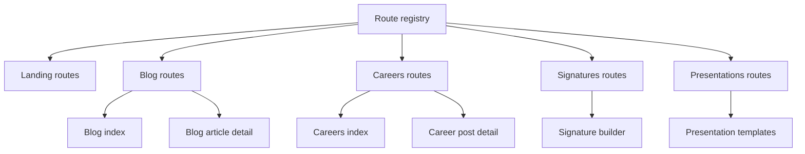
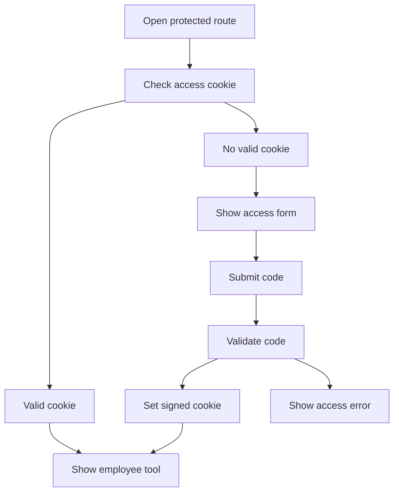
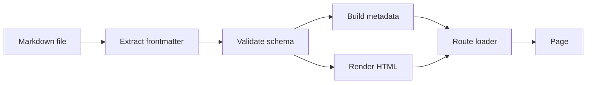

# Urbs Data Landing

Institutional website for Urbs Data, built as a bilingual platform for the company website, editorial content, hiring pages, and employee-only tools.

The site explains how Urbs Data helps companies organize scattered data, build reliable metrics, automate manual work, and turn information into better business decisions.

## Stack

- React 19
- TanStack Start
- TanStack Router
- TypeScript
- Tailwind CSS 4
- ParaglideJS for Spanish and English content
- Markdown with YAML frontmatter for blog and careers content
- Biome for formatting and linting
- Vitest for tests

## Requirements

- Node.js compatible with the project lockfile
- pnpm

Install dependencies:

```bash
pnpm install
```

Start the local development server:

```bash
pnpm dev
```

The dev server runs at:

```text
http://localhost:3100
```

## Scripts

```bash
pnpm dev              # Start Vite on port 3100
pnpm build            # Build for production
pnpm preview          # Preview the production build
pnpm test             # Run Vitest
pnpm format           # Format with Biome
pnpm lint             # Lint with Biome
pnpm check            # Run full Biome checks
pnpm generate-routes  # Regenerate the TanStack Router route tree
```

## Project Structure

```text
src/features/landing        Main landing page
src/features/blog           Blog routes, Markdown content, and parser
src/features/careers        Careers routes, Markdown content, and parser
src/features/signatures     Employee email signature generator
src/features/presentations  Employee PowerPoint template downloads
src/components              Shared UI and layout components
src/i18n/messages           Paraglide translation messages
public/assets               Publicly served site assets
```

Routes are declared through virtual file routes in `src/routes.ts`. Each feature exposes its own route files from `src/features/*/routes`.



## Languages and URLs

Spanish is the base locale and does not use a URL prefix. English uses the `/en` prefix.

| View | Spanish | English |
| --- | --- | --- |
| Home | `/` | `/en` |
| Blog | `/blog` | `/en/blog` |
| Blog article | `/blog/:slug` | `/en/blog/:slug` |
| Careers | `/careers` | `/en/careers` |
| Career post | `/careers/:slug` | `/en/careers/:slug` |
| Signatures | `/signatures` | `/en/signatures` |
| Presentations | `/presentations` | `/en/presentations` |

Localized path patterns live in `src/i18n/url-patterns.ts`. The route segments currently match across both locales, but each Markdown document can still define a locale-specific `slug`.

## Environment Variables

```env
SERVER_URL=
VITE_APP_TITLE=
SIGNATURES_PRESENTATIONS_ACCESS_CODE=
SIGNATURES_PRESENTATIONS_ACCESS_COOKIE_SECRET=
```

`SERVER_URL` and `VITE_APP_TITLE` are optional.

`SIGNATURES_PRESENTATIONS_ACCESS_CODE` enables access to the employee-only signatures and presentations tools. Do not document, commit, or publicly share the actual value. Employees who need access should request the code from their leaders.

`SIGNATURES_PRESENTATIONS_ACCESS_COOKIE_SECRET` is optional, but recommended in shared or production environments. If it is not set, the access code is used as the cookie signing secret.

## Employee-Only Routes

The signatures and presentations routes share the same access gate. Access is granted with a 6-digit code and stored in an HTTP-only cookie for 8 hours.



### Signatures

Routes:

```text
/signatures
/en/signatures
```

This page contains the internal email signature generator. It is protected by the employee access gate and renders `SignatureBuilder` after access is granted.

Employees should ask their leaders for the access code. The code does not belong in this README or in any public document.

### Presentations

Routes:

```text
/presentations
/en/presentations
```

This page lets employees download editable PowerPoint templates using the Urbs Data visual identity. It is also protected by the employee access gate.

Available templates:

```text
executive
data-review
pitch
case-study
```

Each template has two modes:

```text
light
dark
```

Downloads go through:

```text
GET /api/presentations/templates/:template/:mode?locale=es
GET /api/presentations/templates/:template/:mode?locale=en
```

Example endpoints:

```text
/api/presentations/templates/executive/light?locale=es
/api/presentations/templates/data-review/dark?locale=en
```

The endpoint returns `401 Unauthorized` when there is no valid access cookie. PowerPoint files are generated by `src/features/presentations/lib/pptx-templates.ts`, and the visible catalog lives in `src/features/presentations/lib/template-catalog.ts`.

Template previews live in:

```text
public/assets/presentations/executive.png
public/assets/presentations/data-review.png
public/assets/presentations/pitch.png
public/assets/presentations/case-study.png
```

The page also links to the template fonts:

- Instrument Sans
- IBM Plex Sans
- Pitagon Sans Mono

## Content Workflow

Blog and careers content use Markdown files with strict YAML frontmatter. The parsers validate every document with Zod, so missing required fields or unexpected fields fail early during server rendering or build.



## Blog

Blog articles live in:

```text
src/features/blog/content/es
src/features/blog/content/en
```

Each article is a `.md` file with YAML frontmatter at the top. The parser is `src/features/blog/lib/blog.ts`.

### Blog Frontmatter

```md
---
id: "company-evolution-is-designed"
slug: "the-evolution-of-a-company-is-designed-too"
title: "The evolution of a company is designed too"
description: "Short summary used by lists, SEO, and Open Graph."
date: "2026-07-04"
author: "Name Surname, Role at Urbs Data"
readTime: "9 min"
tags:
  - Branding
  - Frontend
  - Architecture
coverImage: "./cover.jpg"
coverImageAlt: "Accessible description of the cover image"
---
```

Fields:

- `id`: stable article identifier. Use the same `id` in `es` and `en` so the site can connect translations.
- `slug`: final URL segment. It can be translated per locale.
- `title`: visible article title.
- `description`: visible summary, meta description, and Open Graph source text.
- `date`: date in `YYYY-MM-DD` format. Lists are sorted from newest to oldest.
- `author`: visible byline.
- `readTime`: visible reading time, for example `9 min`.
- `tags`: visible tags. At least one tag is required.
- `coverImage`: optional cover image. Defaults to an empty string.
- `coverImageAlt`: optional cover image alt text. If omitted and a cover exists, the article title is used as fallback.

Even though `coverImage` and `coverImageAlt` have defaults, include them whenever the article has a cover image.

### Writing a Blog Post

1. Create the article in both languages with the same `id`.
2. Use clear, permanent slugs.
3. Fill every editorial frontmatter field.
4. Write the body below the closing `---`.
5. Run `pnpm test` or `pnpm build` to validate frontmatter and rendering.

Example file names:

```text
src/features/blog/content/es/mi-articulo.md
src/features/blog/content/en/my-article.md
```

This folder-based format is also supported when an article needs colocated assets:

```text
src/features/blog/content/es/mi-articulo/index.md
src/features/blog/content/es/mi-articulo/cover.jpg
src/features/blog/content/en/my-article/index.md
src/features/blog/content/en/my-article/cover.jpg
```

### Images in Blog Posts

The blog resolves local images with `import.meta.glob`, so images can live next to the Markdown file and be referenced relatively:

```md

```

You can also use public asset paths:

```md

```

Or place public blog assets under:

```text
public/assets/blog
```

And reference them like this:

```md

```

The renderer preserves absolute URLs, paths starting with `/`, anchors, and external URLs:

```md

```

Images automatically receive `loading="lazy"` and `decoding="async"`. Raw HTML is disabled because `markdown-it` runs with `html: false`.

### Supported Markdown

The article page styles headings, paragraphs, lists, links, blockquotes, tables, inline code, code blocks, and images.

## Careers

Career posts live in:

```text
src/features/careers/content/es
src/features/careers/content/en
```

The parser is `src/features/careers/lib/careers.ts` and validates frontmatter with Zod. The content folders already exist even when there are no active career posts.

### Career Frontmatter

```md
---
id: "frontend-engineer"
slug: "frontend-engineer"
title: "Frontend Engineer"
description: "We are looking for someone to build clear, robust, and polished data interfaces."
date: "2026-07-04"
team: "Engineering"
location: "Remote / Argentina"
type: "Full-time"
applyUrl: ""
---
```

Fields:

- `id`: stable career post identifier. Use the same `id` in `es` and `en` so the site can connect translations.
- `slug`: final URL segment.
- `title`: visible role name.
- `description`: summary used in the list, detail page, SEO, and Open Graph.
- `date`: date in `YYYY-MM-DD` format. Lists are sorted from newest to oldest.
- `team`: team or department.
- `location`: location or work modality.
- `type`: contract type or dedication.
- `applyUrl`: optional external application URL. If empty, the apply button opens an email to `careers@urbsdata.com`.

Do not add extra fields. The schema is strict.

### Writing a Career Post

1. Create a `.md` file in `src/features/careers/content/es`.
2. Create its equivalent in `src/features/careers/content/en`.
3. Keep the same `id` in both languages.
4. Translate `slug`, `title`, `description`, `team`, `location`, `type`, and the body when needed.
5. Leave `applyUrl` empty to use the default email flow, or set it to an absolute URL.
6. Run `pnpm build` to confirm the frontmatter is valid.

Example:

```text
src/features/careers/content/es/frontend-engineer.md
src/features/careers/content/en/frontend-engineer.md
```

Suggested body structure:

```md
## About the role

Context about the position.

## Responsibilities

- Main responsibility.
- Secondary responsibility.

## Requirements

- Relevant experience.
- Technical judgment.

## How we work

Cultural and operating context.
```

### Images in Career Posts

Careers renders standard Markdown, but it does not have the blog-specific image resolver. If a career post needs images, use public paths or absolute URLs.

Recommended:

```text
public/assets/careers/frontend-engineer/team.jpg
```

```md

```

Avoid relative references like `./team.jpg` in careers unless an asset resolver is added to that feature.

## SEO and Open Graph

Base metadata helpers live in `src/features/landing/lib/seo.ts`.

Blog and careers generate:

- `title`
- `description`
- canonical URL
- Open Graph title, description, URL, and image
- Twitter title, description, and image

Blog articles also add:

- `og:type=article`
- `article:published_time`
- `article:author`
- `article:tag`

Open Graph images are generated through the landing `og-image` route.

## Assets

Main public assets:

```text
public/assets/brand
public/assets/companies
public/assets/presentations
public/assets/urbs-brand-guidelines-es.pdf
public/assets/urbs-brand-guidelines-en.pdf
```

Assets that must be served by public URL should live inside `public`. Vite serves them from the site root:

```text
public/assets/brand/logo.svg -> /assets/brand/logo.svg
```

## Development Notes

After changing physical route files, run:

```bash
pnpm generate-routes
```

Before shipping changes, run at least:

```bash
pnpm check
pnpm test
```

To validate production output:

```bash
pnpm build
```

## Security Notes

- Never commit secrets or access codes.
- Never document the real value of `SIGNATURES_PRESENTATIONS_ACCESS_CODE`.
- `/signatures` and `/presentations` are employee-only routes.
- Employees should request the access code from their leaders.
- If the access mechanism changes, update `src/lib/employee-access.ts`, `src/server.ts`, and this README together.
